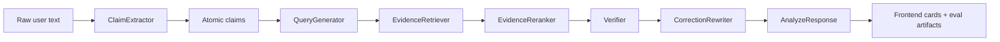

# Comprehensive Project Design Document

项目名称：**Multi-Stage Prompt-Agent Automated Fact Checking System**

本文档是一份完整的项目设计说明，用于帮助团队准备课程报告、答辩、代码讲解和后续维护。它不是简单的 README，也不是只面向演示的脚本，而是把项目目标、系统架构、技术栈选择、设计原理、实现细节、评测设计、遇到的问题、解决方案、限制、后续追问和推荐回答统一整理在一个 Markdown 文件中。

如果只读一份文档来理解这个项目，建议先读本文档，再根据需要查看更细的专题文档：

- [architecture.md](architecture.md)
- [prompt_design.md](prompt_design.md)
- [evaluation.md](evaluation.md)
- [failure_analysis.md](failure_analysis.md)
- [results_interpretation.md](results_interpretation.md)
- [demo_script.md](demo_script.md)
- [final_submission_master_guide.md](final_submission_master_guide.md)

## 1. 项目一句话总结

本项目实现了一个多阶段 prompt-agent fact-checking 系统：它将用户输入的自由文本拆成 atomic factual claims，检索证据，为每条 claim 判定 `Supported`、`Refuted` 或 `Not Enough Info`，并在证据足够时生成带引用的最小修正 rewrite。

## 2. 项目核心动机

事实核查很难直接交给一个单一 prompt 解决，原因包括：

- 一个段落通常包含多个事实断言，模型如果一次性回答容易混淆不同 claim。
- 判断 claim 是否正确需要证据，证据检索和事实判断是两个不同问题。
- 新近事件可能发生在模型预训练知识之后，不能依赖模型“记忆”。
- 某些 claim 没有足够证据，此时正确行为应该是 `Not Enough Info`，而不是强行支持或反驳。
- 如果没有结构化输出，系统很难评测、调试、解释和复现。

本项目的主张是：**fact checking 不应该只是写一个更长的 prompt，而应该设计一个多阶段、可验证、可回退、可评测的 prompt-engineering workflow。**

## 3. 课程对齐点

这个项目明确面向 prompt-engineering 课程要求，而不是普通的机器学习 demo。

### 3.1 Prompt engineering in the small

项目通过以下方式体现 prompt engineering in the small：

- 每个 stage 都有单独 prompt。
- prompt 明确 role、task、constraints、output format。
- 每个 LLM stage 都要求 strict JSON 输出。
- Pydantic schema 对输出进行验证。
- malformed output 会触发 retry。
- verifier prompt 明确鼓励保守的 `not_enough_info`。
- correction prompt 强调 minimal edit 和 citation awareness。

相关代码：

- [backend/app/pipeline/prompt_templates](../backend/app/pipeline/prompt_templates)
- [backend/app/pipeline/prompt_manager.py](../backend/app/pipeline/prompt_manager.py)
- [backend/app/pipeline/base.py](../backend/app/pipeline/base.py)

### 3.2 Prompt engineering in the large

项目通过以下方式体现 prompt engineering in the large：

- 多阶段 orchestration，而不是单次 prompt 调用。
- 每个阶段之间有明确数据流和 schema contract。
- retrieval 作为单独系统变量，而不是隐藏在模型内部。
- provider、corpus、index、prompt、threshold 都是环境因素。
- evaluation 同时比较 single-prompt baseline 和 multi-stage pipeline。
- failure analysis 按 pipeline stage 分类，而不是只看最终 label。

相关代码：

- [backend/app/pipeline/orchestrator.py](../backend/app/pipeline/orchestrator.py)
- [eval/run_baseline.py](../eval/run_baseline.py)
- [eval/run_multistage.py](../eval/run_multistage.py)
- [docs/failure_analysis.md](failure_analysis.md)

## 4. 项目目标

### 4.1 功能目标

系统需要完成以下功能：

1. 接收用户输入的 raw text。
2. 从文本中抽取 atomic factual claims。
3. 为每条 claim 生成 retrieval-friendly query。
4. 从本地 evidence corpus 中检索 top-k evidence chunks。
5. 对 evidence 进行 reranking。
6. 为每条 claim 生成 verdict。
7. 在需要时生成 corrected rewrite。
8. 输出 evidence metadata，便于 citation 和 frontend 展示。
9. 保存 structured run artifacts，便于 evaluation 和 report 使用。

### 4.2 工程目标

工程上需要满足：

- Backend 使用 Python + FastAPI。
- Frontend 使用 Next.js + TypeScript + Tailwind + Framer Motion。
- Retrieval 使用 sentence-transformers + FAISS。
- LLM provider 抽象化，后续可以接 OpenAI API。
- 所有 stage 使用 strict schema。
- 系统有 retries、validation、loop caps 和 conservative fallback。
- 支持 Docker。
- 支持 benchmark evaluation 和 curated recent-news evaluation。
- 前端要能展示 pipeline、claim cards、evidence cards、confidence、rewrite、evaluation results。

### 4.3 学术目标

报告和答辩中要突出：

- 为什么 single prompt fact checking 不够可靠。
- 为什么把任务拆成多阶段更可解释。
- 为什么 recent-news track 能回应 outdated pretrained knowledge 问题。
- 为什么 `NEI` 是保守事实核查中的重要 label。
- 为什么 evaluation 要包括 positive evidence 和 negative evidence。

## 5. 仓库结构

```text
.
├── backend/      FastAPI backend, pipeline, providers, schemas, retrieval hooks
├── frontend/     Next.js UI, demo, results, focused example view
├── docs/         Architecture, prompt, evaluation, report, demo, design docs
├── scripts/      Setup, indexing, evaluation helpers
├── data/         Benchmark, recent-news, local evidence corpus
├── eval/         Evaluation runners, metrics, comparison utilities
├── examples/     Sample inputs, outputs, prompts
└── tests/        Backend tests for schemas, pipeline, retrieval, metrics
```

## 6. 系统总览

完整流程如下：



核心思想是：每个 stage 只做一件事，并通过 schema 把输出交给下一个 stage。

## 7. Backend 设计

Backend 入口：

- [backend/app/main.py](../backend/app/main.py)

API router：

- [backend/app/api/router.py](../backend/app/api/router.py)

主要 endpoints：

- `GET /api/v1/health`
- `POST /api/v1/analyze`
- `POST /api/v1/fact-check`
- `GET /api/v1/examples`

### 7.1 `/health`

`/health` 返回：

- app status
- environment
- provider name
- provider configured status

它用于快速确认 backend 是否正确运行，以及当前是否配置了外部 LLM provider。

相关文件：

- [backend/app/api/routes/health.py](../backend/app/api/routes/health.py)

### 7.2 `/analyze`

`/analyze` 是前端主要调用接口。

输入 schema：

- `input_text`
- `dataset_name`
- `include_rewrite`
- `max_claims`
- `top_k_evidence`

输出包括：

- run id
- dataset name
- input text
- claim-level results
- evidence
- labels
- rationales
- corrected rewrite
- stage trace
- pipeline metadata

相关文件：

- [backend/app/api/routes/analyze.py](../backend/app/api/routes/analyze.py)
- [backend/app/schemas/pipeline.py](../backend/app/schemas/pipeline.py)

## 8. Pipeline Orchestrator 设计

核心 orchestrator：

- [backend/app/pipeline/orchestrator.py](../backend/app/pipeline/orchestrator.py)

它负责：

1. 创建 run id。
2. 调用 ClaimExtractor。
3. 对每条 claim 顺序执行 query generation、retrieval、reranking、verification、rewrite。
4. 汇总 supported/refuted/NEI 数量。
5. 生成 PipelineMetadata。
6. 写入 experiment output。

### 8.1 为什么需要 orchestrator

如果没有 orchestrator，每个 stage 只是孤立函数，无法体现 prompt engineering in the large。Orchestrator 让系统具备：

- 明确 stage 顺序。
- 统一 trace。
- 统一 fallback 统计。
- 统一 response schema。
- 统一 evaluation artifact。

### 8.2 Stage trace

每个 stage 返回 `StageTrace`，包含：

- stage name
- status: `success` 或 `fallback`
- detail
- duration
- retries
- claim id

这让前端能展示 pipeline trace，也让 failure analysis 能定位错误发生在哪个阶段。

## 9. Stage 详细设计

### 9.1 ClaimExtractor

文件：

- [backend/app/pipeline/claim_extractor.py](../backend/app/pipeline/claim_extractor.py)

输入：

- raw source text
- max claims

输出：

- `ClaimExtractionOutput`
- list of `AtomicClaim`

设计原则：

- 只抽取 factual claims。
- 尽量拆分 compound sentence。
- 每条 claim 保留 source span。
- 不抽取意见、推测和无法验证的表达。

LLM path：

- 使用 externalized prompt。
- 要求 strict JSON。
- 使用 Pydantic 校验。

Fallback path：

- 使用 deterministic sentence splitting。
- 再用 compound splitting 规则拆分。
- 生成 claim id。
- 加入 fallback notes。

为什么 fallback 重要：

- 没有外部 API 时系统仍然可运行。
- LLM malformed output 时系统不会中断。
- 演示和评测更稳定。

### 9.2 QueryGenerator

文件：

- [backend/app/pipeline/query_generator.py](../backend/app/pipeline/query_generator.py)

输入：

- one atomic claim

输出：

- primary query
- alternative queries
- keywords

设计原则：

- 不负责判断 claim 真伪。
- 只负责把 claim 改写成更适合 retrieval 的 query。
- 保留实体、日期、数字、事件词。

Fallback path：

- 使用 keyword extraction。
- 将原 claim 与 keywords 拼接为 query。

为什么 query generation 独立：

- retrieval quality 和 verification quality 是不同问题。
- query drift 是可单独分析的 failure mode。
- 方便调试为什么某条 claim 没找到证据。

### 9.3 EvidenceRetriever

文件：

- [backend/app/pipeline/evidence_retriever.py](../backend/app/pipeline/evidence_retriever.py)
- [backend/retrieval/retriever.py](../backend/retrieval/retriever.py)

输入：

- claim
- generated query
- top-k

输出：

- ranked evidence items
- retrieval strategy

设计原则：

- 优先 dense retrieval。
- 如果 FAISS index 不存在或依赖不可用，退回 lexical fallback。
- EvidenceItem 保留 source metadata。

Evidence metadata 包括：

- evidence id
- chunk id
- source document id
- title
- snippet
- URL
- publication date
- source path
- source type
- stance hint
- retrieval score

### 9.4 EvidenceReranker

文件：

- [backend/app/pipeline/evidence_reranker.py](../backend/app/pipeline/evidence_reranker.py)
- [backend/retrieval/reranker.py](../backend/retrieval/reranker.py)

输入：

- claim
- retrieved evidence items
- top-k

输出：

- reranked evidence items
- selected evidence ids
- weak evidence flag

当前 reranking strategy：

- retrieval score
- lexical overlap
- numeric match bonus
- stance hint bonus

为什么需要 reranking：

- dense retrieval 可能找到 topical evidence，但不一定找到 decisive evidence。
- reranking 可以提升包含关键数字、实体、支持/反驳 hint 的 chunk。

### 9.5 Verifier

文件：

- [backend/app/pipeline/verifier.py](../backend/app/pipeline/verifier.py)

输入：

- claim
- reranked evidence items

输出：

- label
- confidence
- rationale
- citation ids
- evidence strength

三种 label：

- `supported`: evidence 明确支持 claim。
- `refuted`: evidence 明确反驳 claim。
- `not_enough_info`: evidence 不足、间接、混合、或不能直接判断。

设计原则：

- verifier 只能使用 retrieved evidence。
- evidence 弱时保守返回 NEI。
- 不允许因为主题相关就直接 support。
- 不要求暴露 chain-of-thought，只输出 concise rationale。

Fallback logic：

- 无 evidence -> NEI。
- top evidence 是 context -> NEI。
- top evidence stance 是 refutes -> REFUTED。
- top evidence stance 是 supports 但分数/overlap 不够 -> NEI。
- top evidence 支持且分数足够 -> SUPPORTED。

### 9.6 CorrectionRewriter

文件：

- [backend/app/pipeline/correction_rewriter.py](../backend/app/pipeline/correction_rewriter.py)

输入：

- claim
- verification output
- evidence items

输出：

- corrected text
- citations
- citation ids
- edit summary

设计原则：

- NEI 不 rewrite。
- rewrite 必须 minimal edit。
- rewrite 必须 citation-aware。
- 不添加 evidence 没有支持的新事实。

Fallback path：

- 如果 label 是 `refuted`，使用 top evidence snippet 生成保守 rewrite。
- 如果 label 是 `supported` 或 `not_enough_info`，通常不生成 rewrite。

## 10. Schema 设计

Schema 文件：

- [backend/app/schemas/common.py](../backend/app/schemas/common.py)
- [backend/app/schemas/claims.py](../backend/app/schemas/claims.py)
- [backend/app/schemas/evidence.py](../backend/app/schemas/evidence.py)
- [backend/app/schemas/verification.py](../backend/app/schemas/verification.py)
- [backend/app/schemas/correction.py](../backend/app/schemas/correction.py)
- [backend/app/schemas/pipeline.py](../backend/app/schemas/pipeline.py)

### 10.1 为什么使用 Pydantic

选择 Pydantic 的原因：

- FastAPI 原生集成。
- 运行时 validation 清晰。
- JSON schema 可用于 prompt output format。
- 适合定义 strict contracts。
- 错误信息清楚，方便 retries 和 debugging。

### 10.2 Strict schemas 的价值

Strict schema 能防止：

- LLM 输出多余字段。
- LLM 漏字段。
- label 拼写不一致。
- confidence 超出范围。
- frontend 接收到不稳定结构。

### 10.3 AnalyzeResponse

`AnalyzeResponse` 是最终 API response，也是 frontend 和 evaluation 使用的核心结构。

它包含：

- `run_id`
- `dataset_name`
- `input_text`
- `claims`
- `stage_trace`
- `summary`
- `pipeline_metadata`

## 11. Provider 抽象

相关文件：

- [backend/app/providers/base.py](../backend/app/providers/base.py)
- [backend/app/providers/mock.py](../backend/app/providers/mock.py)
- [backend/app/providers/openai.py](../backend/app/providers/openai.py)
- [backend/app/providers/factory.py](../backend/app/providers/factory.py)

### 11.1 为什么需要 provider abstraction

课程项目需要既能展示真实 LLM 调用设计，也能在没有 API 或网络时运行。Provider abstraction 让系统具备：

- mock provider offline mode。
- OpenAI-compatible provider extension point。
- stage fallback 逻辑。
- 后续替换模型的灵活性。

### 11.2 Mock provider

Mock provider 不调用外部模型，而是主动抛出错误，使 stage 进入 deterministic fallback。

这样做的好处：

- 没有 API key 也可以运行。
- 演示更稳定。
- 便于测试 pipeline mechanics。

### 11.3 OpenAI-compatible provider

OpenAI-compatible provider 使用 structured response parsing。它被设计为后续可接 OpenAI API。

注意：

- 本地 `.env` 可配置 API key。
- API key 不应提交到 GitHub。
- 若未安装 `backend[openai]`，provider 会提示需要安装 OpenAI optional dependency。

## 12. Prompt 设计

Prompt 文件：

- [backend/app/pipeline/prompt_templates/claim_extractor.system.md](../backend/app/pipeline/prompt_templates/claim_extractor.system.md)
- [backend/app/pipeline/prompt_templates/claim_extractor.user.md](../backend/app/pipeline/prompt_templates/claim_extractor.user.md)
- [backend/app/pipeline/prompt_templates/query_generator.system.md](../backend/app/pipeline/prompt_templates/query_generator.system.md)
- [backend/app/pipeline/prompt_templates/query_generator.user.md](../backend/app/pipeline/prompt_templates/query_generator.user.md)
- [backend/app/pipeline/prompt_templates/verifier.system.md](../backend/app/pipeline/prompt_templates/verifier.system.md)
- [backend/app/pipeline/prompt_templates/verifier.user.md](../backend/app/pipeline/prompt_templates/verifier.user.md)
- [backend/app/pipeline/prompt_templates/correction_rewriter.system.md](../backend/app/pipeline/prompt_templates/correction_rewriter.system.md)
- [backend/app/pipeline/prompt_templates/correction_rewriter.user.md](../backend/app/pipeline/prompt_templates/correction_rewriter.user.md)

Prompt manager：

- [backend/app/pipeline/prompt_manager.py](../backend/app/pipeline/prompt_manager.py)

### 12.1 Prompt 共同原则

- JSON only。
- 明确 role。
- 明确 task。
- 明确 constraints。
- 明确 output schema。
- 禁止 unsupported claims。
- verifier 强调 NEI。
- correction rewrite 强调 minimal edit。

### 12.2 为什么 prompt externalization 重要

Prompt 写在独立模板文件中，而不是硬编码在业务逻辑里，有几个好处：

- 便于 versioning。
- 便于报告展示。
- 便于 prompt iteration。
- 便于把 prompt design 和 pipeline logic 分开解释。
- 便于后续做 prompt ablation。

## 13. Retrieval 子系统

核心文件：

- [backend/retrieval/chunking.py](../backend/retrieval/chunking.py)
- [backend/retrieval/index_store.py](../backend/retrieval/index_store.py)
- [backend/retrieval/retriever.py](../backend/retrieval/retriever.py)
- [backend/retrieval/reranker.py](../backend/retrieval/reranker.py)
- [scripts/build_index.py](../scripts/build_index.py)

### 13.1 Corpus loading

系统支持从本地目录加载 corpus。

当前 demo corpus：

- [data/corpus/demo](../data/corpus/demo)

支持格式：

- `.json`
- `.txt`
- `.md`

JSON document 支持：

- document id
- title
- text
- URL
- publication date
- stance hint
- metadata

### 13.2 Chunking

Chunking 通过 word window 完成。

默认配置：

- `chunk_size_words`: 110
- `chunk_overlap_words`: 25
- `min_chunk_words`: 25

为什么这样设计：

- 课程 demo corpus 较小，word-level chunking 足够透明。
- overlap 能减少关键信息跨 chunk 边界丢失。
- chunk metadata 保留原文档 provenance。

### 13.3 Dense indexing

Dense indexing 使用：

- sentence-transformers
- FAISS `IndexFlatIP`

默认 embedding model：

- `all-MiniLM-L6-v2`

为什么选择它：

- 轻量。
- 本地可运行。
- 适合 course project demo。
- 与 FAISS 搭配成熟。

### 13.4 Lexical fallback

如果 FAISS index 不存在，或依赖未安装，retriever 会使用 lexical overlap fallback。

这样做的原因：

- 系统不会因为 index 缺失完全不可用。
- demo 和 tests 更稳定。
- failure trace 更清楚。

### 13.5 Evidence metadata

每条 evidence 保留：

- source title
- URL
- publication date
- source document id
- source path
- retrieval score
- rerank score
- stance hint

这让 frontend 能展示 citation，也让 evaluation 能计算 retrieval recall@k。

## 14. Evaluation 设计

Evaluation 文件：

- [eval/run_baseline.py](../eval/run_baseline.py)
- [eval/run_multistage.py](../eval/run_multistage.py)
- [eval/metrics.py](../eval/metrics.py)
- [eval/compare_runs.py](../eval/compare_runs.py)
- [eval/report_tables.py](../eval/report_tables.py)
- [eval/recent_claims.py](../eval/recent_claims.py)

### 14.1 两种 evaluation mode

#### Single-prompt baseline

Baseline 把 claim 和 evidence 一起给一个 prompt，直接预测 label 和 rationale。

目的：

- 提供简单对照组。
- 显示 multi-stage decomposition 的价值。

#### Multi-stage pipeline

Multi-stage mode 跑完整 orchestrator。

目的：

- 测试完整系统。
- 观察每个阶段对最终质量的影响。
- 收集 stage trace 和 evidence selections。

### 14.2 两条 dataset track

#### Benchmark-style track

位置：

- [data/benchmark/claims.jsonl](../data/benchmark/claims.jsonl)

用途：

- 稳定 gold labels。
- 可重复比较。
- 适合衡量 label accuracy 和 macro F1。

#### Curated recent-news track

位置：

- [data/recent_news/claims.jsonl](../data/recent_news/claims.jsonl)
- [data/recent_news/curated_examples](../data/recent_news/curated_examples)

用途：

- 测试 post-cutoff or freshness-sensitive claims。
- 保留 source article title、publication date、source URL。
- 避免把 recent events 当作模型预训练知识。

### 14.3 Metrics

当前实现的指标：

- label accuracy
- macro F1
- per-label precision/recall/F1
- retrieval recall@k
- NEI usage stats
- predicted label distribution
- gold label distribution
- claims with/without gold labels

指标文件：

- [eval/metrics.py](../eval/metrics.py)

### 14.4 Evaluation artifacts

每次 evaluation 会生成 timestamped run directory，包括：

- `config.json`
- `predictions.json`
- `claim_predictions.csv`
- `summary.json`

这些 artifacts 便于：

- report table。
- error analysis。
- baseline vs multistage comparison。
- later regression checks。

## 15. Frontend 设计

Frontend 使用：

- Next.js App Router
- TypeScript
- Tailwind CSS
- Framer Motion
- shadcn/ui-style components
- lucide-react icons

入口：

- [frontend/src/app/page.tsx](../frontend/src/app/page.tsx)
- [frontend/src/app/demo/page.tsx](../frontend/src/app/demo/page.tsx)
- [frontend/src/app/showcase/page.tsx](../frontend/src/app/showcase/page.tsx)
- [frontend/src/app/results/page.tsx](../frontend/src/app/results/page.tsx)

### 15.1 Homepage

Homepage 负责建立系统概念：

- 项目标题和核心价值。
- 五阶段 architecture preview。
- example cases。
- evaluation teaser。
- navigation 到 demo、focused view、results。

核心组件：

- [frontend/src/components/landing/hero-section.tsx](../frontend/src/components/landing/hero-section.tsx)
- [frontend/src/components/landing/architecture-preview.tsx](../frontend/src/components/landing/architecture-preview.tsx)
- [frontend/src/components/landing/example-showcase-section.tsx](../frontend/src/components/landing/example-showcase-section.tsx)
- [frontend/src/components/landing/pipeline-section.tsx](../frontend/src/components/landing/pipeline-section.tsx)
- [frontend/src/components/landing/evaluation-section.tsx](../frontend/src/components/landing/evaluation-section.tsx)

### 15.2 Demo page

Demo page 是主要交互入口。

功能：

- 选择 example。
- 编辑 input text。
- 调用 backend `/api/v1/analyze`。
- 展示 pipeline progress。
- 展示 result summary。
- 展示 claim cards。
- 展示 evidence cards。
- 展示 pipeline trace。
- 展示 run metadata。
- backend 不可用时 fallback 到 local sample。

核心组件：

- [frontend/src/components/demo/demo-shell.tsx](../frontend/src/components/demo/demo-shell.tsx)
- [frontend/src/components/demo/pipeline-progress.tsx](../frontend/src/components/demo/pipeline-progress.tsx)
- [frontend/src/components/demo/result-overview.tsx](../frontend/src/components/demo/result-overview.tsx)
- [frontend/src/components/demo/claim-result-card.tsx](../frontend/src/components/demo/claim-result-card.tsx)
- [frontend/src/components/demo/stage-timeline.tsx](../frontend/src/components/demo/stage-timeline.tsx)

### 15.3 Focused view

Focused view 是一个单案例展开页面。

入口：

- `/showcase`

用途：

- 展开 recent-news 代表案例。
- 显示 pipeline、summary、claim cards。
- 支持一键 run live。
- 支持打开 full demo。

核心组件：

- [frontend/src/components/showcase/presentation-case-shell.tsx](../frontend/src/components/showcase/presentation-case-shell.tsx)

### 15.4 Results page

Results page 展示 evaluation comparison。

功能：

- benchmark track vs recent-news track。
- single-prompt baseline vs multi-stage。
- accuracy、macro F1、recall@k、NEI rate。
- success/failure case studies。

核心组件：

- [frontend/src/components/results/evaluation-shell.tsx](../frontend/src/components/results/evaluation-shell.tsx)

### 15.5 Frontend API integration

文件：

- [frontend/src/lib/api.ts](../frontend/src/lib/api.ts)

前端调用：

- `POST ${NEXT_PUBLIC_API_BASE_URL}/api/v1/analyze`

请求参数：

- `input_text`
- `dataset_name`
- `include_rewrite: true`
- `max_claims: 6`
- `top_k_evidence: 4`

前端还做 response normalization，避免 backend response 轻微变化导致 UI 崩溃。

### 15.6 Local sample fallback

文件：

- [frontend/src/lib/demo-data.ts](../frontend/src/lib/demo-data.ts)

如果 backend 请求失败，demo page 会使用本地 sample result。

这样做的原因：

- 保持交互稳定。
- 让 UI 可单独展示。
- 避免 external API 或 backend 临时问题阻断演示。

## 16. 技术栈选择与理由

### 16.1 FastAPI

选择原因：

- Python 生态适合 LLM、Pydantic、sentence-transformers、FAISS。
- FastAPI 原生支持 schema-driven API。
- 自动生成 OpenAPI docs。
- 与 Pydantic 配合自然。
- 开发速度快，适合课程项目。

### 16.2 Pydantic

选择原因：

- 定义 strict typed interfaces。
- 校验 LLM structured outputs。
- 提供 JSON schema。
- 与 FastAPI response_model 集成。

### 16.3 sentence-transformers

选择原因：

- 本地 embedding 能力成熟。
- `all-MiniLM-L6-v2` 轻量。
- 不依赖外部 API。
- 能支持 course demo 的 dense retrieval。

### 16.4 FAISS

选择原因：

- 向量检索成熟。
- 本地可运行。
- 与 sentence-transformers 输出兼容。
- 对小型 demo corpus 足够快。

### 16.5 Next.js + TypeScript

选择原因：

- App Router 适合多页面 demo。
- TypeScript 提升 frontend schema safety。
- 与 component-based UI 组织方式匹配。
- 方便部署和本地运行。

### 16.6 Tailwind CSS

选择原因：

- 快速构建一致视觉系统。
- 适合响应式布局。
- 便于细粒度控制 spacing、typography、state。

### 16.7 Framer Motion

选择原因：

- 用于 pipeline progress、card reveal、page transition。
- 动效逻辑集中在组件层。
- 不增加复杂状态管理。

### 16.8 Docker

选择原因：

- 统一本地运行环境。
- 简化 frontend + backend 启动。
- 支持课程提交时复现。

## 17. Reproducible configuration

Backend environment template：

- [backend/.env.example](../backend/.env.example)

Frontend environment template：

- [frontend/.env.example](../frontend/.env.example)

Pipeline default config：

- [backend/configs/pipeline.default.yaml](../backend/configs/pipeline.default.yaml)

Evaluation configs：

- [eval/configs/benchmark.yaml](../eval/configs/benchmark.yaml)
- [eval/configs/recent_news.yaml](../eval/configs/recent_news.yaml)

常用环境变量：

- `FACT_CHECK_PROVIDER`
- `FACT_CHECK_OPENAI_MODEL`
- `FACT_CHECK_OPENAI_API_KEY`
- `FACT_CHECK_CORPUS_DIR`
- `FACT_CHECK_CORPUS_PATH`
- `FACT_CHECK_RETRIEVAL_INDEX_PATH`
- `FACT_CHECK_SENTENCE_TRANSFORMER_MODEL`
- `FACT_CHECK_MAX_STAGE_RETRIES`
- `FACT_CHECK_CONSERVATIVE_NEI_THRESHOLD`
- `NEXT_PUBLIC_API_BASE_URL`

## 18. 本地运行方式

### 18.1 安装依赖

```bash
make setup
```

如果需要 FAISS 和 sentence-transformers：

```bash
make setup-full
```

### 18.2 构建 retrieval index

```bash
make index
```

或手动指定：

```bash
PYTHONPATH=backend .venv/bin/python scripts/build_index.py \
  --corpus-dir data/corpus/demo \
  --chunk-manifest data/processed/evidence_chunks.jsonl \
  --index-path data/corpus/faiss.index
```

### 18.3 启动 backend

```bash
make backend
```

默认端口：

- `http://localhost:8000`

如果 8000 已被占用，可以手动使用 8001：

```bash
cd backend
../.venv/bin/python -m uvicorn app.main:app --reload --host 0.0.0.0 --port 8001
```

然后在 frontend `.env.local` 中设置：

```bash
NEXT_PUBLIC_API_BASE_URL=http://localhost:8001
```

### 18.4 启动 frontend

```bash
make frontend
```

默认地址：

- `http://localhost:3000`

### 18.5 Docker

```bash
docker compose up --build
```

## 19. Demo examples

Frontend 当前包含三个主要示例。

### 19.1 Benchmark Press Release

输入关于 Riverdale University solar expansion。

它覆盖：

- grid electricity reduction
- project cost
- state funding
- first carbon-neutral campus claim

适合展示：

- supported
- refuted
- NEI
- corrected rewrite

### 19.2 Recent Headline Bundle

输入关于 Blue Line transit extension。

它覆盖：

- early opening
- ridership doubled
- budget surplus

适合展示：

- recent-news freshness。
- retrieval grounding。
- exaggerated headline correction。
- unresolved claim 的 NEI。

### 19.3 Mixed Claim Stack

混合 Riverdale 和 Blue Line claims。

适合展示：

- 用户自定义输入。
- 多主题 claim extraction。
- system robustness。

## 20. 当前实现中遇到的问题与解决方式

### 20.1 问题：不能依赖真实 API 才能运行

原因：

- 课程项目需要可复现。
- API key 可能缺失。
- 网络和 quota 可能不稳定。

解决方式：

- 抽象 `StructuredProvider`。
- 提供 `MockLLMProvider`。
- stage primary path 失败时进入 deterministic fallback。

结果：

- 没有外部 LLM 时 pipeline 仍然能跑。
- 有外部 LLM 时可以切换 provider。

### 20.2 问题：LLM 输出可能不是合法 JSON

原因：

- LLM 可能输出解释文字。
- LLM 可能漏字段。
- LLM 可能 label 拼写不一致。

解决方式：

- prompt 明确 JSON only。
- 每个 stage 使用 Pydantic model validation。
- `invoke_structured_generation` 做 parse retry。
- retry 后仍失败则 fallback。

### 20.3 问题：证据检索可能找不到 decisive evidence

原因：

- corpus 小。
- query 可能 drift。
- dense retrieval 可能只找到 topical evidence。

解决方式：

- dense retrieval + lexical fallback。
- reranker 加入 lexical overlap、number match、stance hint。
- verifier 使用 conservative NEI。

### 20.4 问题：recent claims 可能超出模型预训练知识

原因：

- LLM 的 parametric memory 可能过时。
- recent events 需要 source date 和 source URL。

解决方式：

- 设计 curated recent-news dataset。
- 每条 claim 保留 publication date 和 source URL。
- evaluation 输出保留 metadata。
- frontend evidence card 展示 source metadata。

### 20.5 问题：rewrite 容易过度生成

原因：

- LLM 可能把一个小错误改成完整重写。
- LLM 可能添加 evidence 没有支持的信息。

解决方式：

- correction prompt 强调 minimal edit。
- NEI 不 rewrite。
- citations 从 evidence ids 生成。
- fallback rewrite 只在 refuted 且有 top evidence 时执行。

### 20.6 问题：前端演示不能依赖 backend 永远在线

原因：

- backend 可能未启动。
- 端口可能冲突。
- API 可能超时。

解决方式：

- frontend 有 local sample fallback。
- API 请求设置 timeout。
- response normalization。
- demo page 显示 source mode。

### 20.7 问题：端口冲突

实际开发中，`8000` 可能被其他 FastAPI 项目占用。

解决方式：

- backend 可手动启动到 `8001`。
- frontend `.env.local` 可改 `NEXT_PUBLIC_API_BASE_URL`。

### 20.8 问题：FAISS 未安装导致 index 构建失败

原因：

- minimal setup 只安装 backend dev dependencies。
- FAISS 和 sentence-transformers 放在 `backend[retrieval]` optional extras。

解决方式：

```bash
.venv/bin/pip install -e './backend[dev,retrieval]'
```

然后重新运行：

```bash
PYTHONPATH=backend .venv/bin/python scripts/build_index.py \
  --corpus-dir data/corpus/demo \
  --chunk-manifest data/processed/evidence_chunks.jsonl \
  --index-path data/corpus/faiss.index
```

### 20.9 问题：OpenAI provider configured 但 optional dependency 未安装

原因：

- `.env` 可能设置了 provider 和 API key。
- 但未安装 `backend[openai]`。

现象：

- stage trace 中会出现 `OpenAI support requires installing backend[openai]`。
- 系统会 fallback，不会完全崩溃。

解决方式：

```bash
.venv/bin/pip install -e './backend[dev,retrieval,openai]'
```

### 20.10 问题：UI 文案和布局需要避免过度解释

原因：

- 初版前端为了说明系统，文本较多。
- 某些 architecture cards 在屏幕较窄时可能出现 overflow。

解决方式：

- 缩短用户可见文案。
- 将 stage 副标题压缩为短 label。
- 使用 responsive grid。
- 添加 `break-words`。
- 减少强调“presentation/screenshot”的文案，改成更专业产品语言。

## 21. Security and repository hygiene

### 21.1 API key

API key 不应提交到 GitHub。

当前设计：

- `backend/.env` 本地使用。
- `.env.example` 提交模板。
- `.gitignore` 忽略真实 `.env`。

注意：

- 如果 key 曾经出现在聊天记录或日志中，最稳妥做法是 rotate key。
- 文档和提交中不应包含真实 key。

### 21.2 Generated artifacts

以下内容通常不应作为核心代码提交：

- `.venv`
- `node_modules`
- `__pycache__`
- `.DS_Store`
- large generated eval results
- local secret files

FAISS index 是否提交取决于课程提交策略：

- 如果希望 repo clone 后立刻 demo，可提交小型 demo index。
- 如果希望保持 repo 干净，可只提交 source corpus 和 build script。

## 22. Testing

测试目录：

- [tests/backend](../tests/backend)

已覆盖：

- API behavior
- schema validation
- prompt manager
- chunking
- retriever
- evaluation metrics
- fact check service
- text utilities

常用测试命令：

```bash
make test
```

后端编译检查：

```bash
make backend-check
```

前端检查：

```bash
cd frontend
npm run lint
npm run build
```

## 23. 已知限制

### 23.1 Corpus size 小

当前 demo corpus 适合课程展示，但远不足以覆盖真实世界事实核查。

影响：

- retrieval recall 有上限。
- unresolved claims 会增加。
- 某些 NEI 来自 corpus coverage，不一定来自 verifier 判断能力。

### 23.2 Reranker 是启发式

当前 reranker 使用 lexical overlap、number match 和 stance hint。

影响：

- 简单透明，便于解释。
- 但不如 cross-encoder reranker 精细。

### 23.3 Claim alignment 简化

Evaluation 中 multi-stage predicted claims 和 gold claims 主要按顺序对齐。

影响：

- 如果 extraction granularity 与 gold 不一致，metric 可能受到影响。

### 23.4 Recent-news 数据仍需扩充

当前 recent-news examples 是 demo-friendly curated examples。

未来需要：

- 更多真实 recent headline claims。
- 更完整 gold labels。
- 更完整 gold evidence references。

### 23.5 Live LLM provider 需要进一步实测

Provider interface 已经存在，但不同 OpenAI model 的输出质量、延迟和成本还需要系统评估。

## 24. 推荐改进方向

### 24.1 Retrieval 改进

- 扩大 corpus。
- 添加 web/news source ingestion。
- 添加 source freshness scoring。
- 添加 cross-encoder reranker。
- 为 evidence chunk 添加 finer provenance。

### 24.2 Prompt 改进

- 给每个 prompt 加 version tag。
- 做 prompt ablation。
- 比较 conservative vs aggressive NEI threshold。
- 记录 prompt changes 对 benchmark/recent-news 的影响。

### 24.3 Evaluation 改进

- 扩大 benchmark set。
- 为 recent-news set 添加更多 gold labels。
- 使用 claim alignment algorithm。
- 添加 calibration metrics。
- 添加 cost/latency metrics。

### 24.4 Frontend 改进

- 增加 run history。
- 支持上传 corpus。
- 支持展示 prompt trace，但要避免泄露 private reasoning。
- 支持导出 analysis report。
- 支持 side-by-side baseline vs multistage per claim comparison。

## 25. 可能被问到的 follow-up questions 与推荐回答

### Q1: 为什么不用一个 prompt 直接完成 fact checking？

推荐回答：

一个 prompt 可以给出答案，但很难知道错误来自哪里。我们的系统把 claim extraction、query generation、retrieval、verification 和 rewrite 拆开，每个阶段都有 schema 和 trace。这样更容易调试、评测和解释，也更符合事实核查任务本身的结构。

### Q2: 这个项目的创新点是什么？

推荐回答：

创新点不是训练了一个新模型，而是把 prompt engineering 当作系统设计。项目展示了如何通过 typed interfaces、retrieval grounding、conservative fallback、recent-news evaluation 和 failure analysis 构建一个更可审计的 fact-checking workflow。

### Q3: 为什么需要 recent-news dataset？

推荐回答：

因为 recent claims 可能发生在模型预训练之后。对于这些 claim，模型不能安全地依赖 parametric memory。我们保留 publication date、source title 和 URL，是为了让 freshness 成为显式评测变量。

### Q4: 为什么 `Not Enough Info` 不是失败？

推荐回答：

在事实核查里，证据不足时拒绝过度判断是正确行为。NEI 是系统的保守安全机制。当然，如果 NEI 过多，也可能说明 retrieval 或 calibration 有问题，所以我们单独统计 NEI usage。

### Q5: 如果 retrieval 找错了证据，verifier 还能正确吗？

推荐回答：

通常不能。Verifier 只能根据输入 evidence 判断。这正是我们把 retrieval 单独暴露出来的原因：如果错在 retrieval，我们能在 evidence cards 和 trace 里看到，而不是把所有问题都归因于模型推理。

### Q6: 为什么使用 FAISS，而不是直接用 LLM 搜索？

推荐回答：

FAISS 本地可运行、可复现、成本低，适合课程项目。它也让 retrieval 变成可控模块，方便比较不同 corpus、index 和 reranking 策略。

### Q7: 为什么使用 sentence-transformers？

推荐回答：

它提供轻量本地 embedding，避免完全依赖外部 API。默认模型 `all-MiniLM-L6-v2` 足够小，适合 demo，同时能体现 dense retrieval 的核心思想。

### Q8: 为什么 correction rewrite 要 minimal edit？

推荐回答：

因为 rewrite 的目标不是重新写文章，而是修正错误事实。Minimal edit 能减少模型引入新错误的机会，也让 citation 和修改点更容易对应。

### Q9: 如果 OpenAI API 不可用，系统还能运行吗？

推荐回答：

可以。系统有 mock provider 和 deterministic fallback。没有外部 API 时，pipeline 仍然能抽取 claims、检索 evidence、生成 conservative verdict，并在部分 refuted cases 中生成 fallback rewrite。

### Q10: 为什么 frontend 还需要 local sample fallback？

推荐回答：

Frontend fallback 是为了保证交互稳定。它不会替代 backend evaluation，但能让 UI 在 backend 暂时不可用时仍然展示结构和结果格式。

### Q11: 你的评测指标是否足够？

推荐回答：

当前指标覆盖 label accuracy、macro F1、retrieval recall@k 和 NEI usage，足够支持课程项目分析。但更完整的真实系统还需要 calibration、latency、cost、larger datasets 和 human annotation。

### Q12: 这个系统最大的弱点是什么？

推荐回答：

最大弱点是 corpus coverage 和 retrieval quality。即使 verifier prompt 很好，如果 evidence 没有包含决定性信息，系统也只能返回 NEI 或做出弱判断。

### Q13: 为什么不直接接实时网页搜索？

推荐回答：

实时网页搜索会引入更多复杂性，包括 source reliability、rate limits、copyright、freshness ranking 和 reproducibility。课程项目先用 local corpus 和 curated recent-news set 保持可复现，后续可以扩展到 web retrieval。

### Q14: 你怎么证明 multi-stage 比 baseline 好？

推荐回答：

项目提供 baseline 和 multistage 两套 evaluation runners，输出统一 JSON/CSV artifacts，并计算 accuracy、macro F1、retrieval recall@k 和 NEI stats。更重要的是，multi-stage 输出 evidence 和 stage trace，能解释为什么某些 case 成功或失败。

### Q15: 如果 model hallucinate citations 怎么办？

推荐回答：

Correction output 的 citations 不是自由文本引用，而是 evidence ids。系统会从 retrieved evidence items 中匹配 citation ids 生成 citation objects，因此可以减少模型编造 citation 的风险。

### Q16: Prompt engineering in the small 和 in the large 怎么区分？

推荐回答：

In the small 是每个 prompt 内部的设计，比如 JSON schema、label definitions、NEI guardrails。In the large 是多个 prompts 和 non-LLM modules 如何被组织成系统，包括 orchestration、retrieval、fallback、evaluation 和 environment effects。

### Q17: 为什么要保留 negative evidence？

推荐回答：

因为事实核查系统不能只展示成功案例。Negative evidence 能说明系统哪里会失败，例如 retrieval miss、topical but non-decisive evidence、over-conservative NEI。这让报告更可信。

### Q18: 这个系统能用于真实新闻事实核查吗？

推荐回答：

当前版本是课程项目级原型，不应直接用于真实新闻发布流程。它展示的是一种可扩展架构。要进入真实场景，还需要更大 corpus、更强 source reliability controls、human review、web retrieval 和更多 evaluation。

### Q19: 为什么不 fine-tune 一个模型？

推荐回答：

这个课程项目重点是 prompt engineering。Fine-tuning 需要更大标注数据，也不能解决 evidence freshness 问题。我们选择 retrieval + prompt orchestration，是因为它更符合事实核查需要证据的本质。

### Q20: 如果老师问“你们到底用了多少 LLM 能力？”

推荐回答：

系统设计支持 LLM structured generation，每个 stage 都有 prompt template 和 provider abstraction。但为了可复现和稳定运行，也实现了 deterministic fallback。项目贡献不依赖某一个模型，而是展示如何把 LLM calls 放进可验证的多阶段 workflow。

## 26. 推荐答辩叙事

### 26.1 30 秒开场

我们做的是一个 multi-stage prompt-agent fact-checking system。它不是用一个 prompt 直接判断真假，而是把事实核查拆成 claim extraction、query generation、retrieval、reranking、verification 和 correction rewrite。这样每一步都有 schema、trace 和 fallback，系统更容易调试和评测。

### 26.2 60 秒 architecture

首先用户输入一段文本。ClaimExtractor 把文本拆成 atomic claims。QueryGenerator 为每条 claim 生成检索查询。EvidenceRetriever 从本地 corpus 中找 evidence，EvidenceReranker 提升最相关证据。Verifier 只基于 retrieved evidence 判断 Supported、Refuted 或 NEI。CorrectionRewriter 只在证据足够明确时生成最小修正，并带 citation。

### 26.3 60 秒 demo

在 demo 中，可以选择 benchmark、recent-news 或 custom input。系统会显示每条 claim 的 label、confidence、rationale 和 evidence cards。Evidence cards 保留 title、date、URL 和 relevance scores。Recent-news example 用来说明为什么 post-cutoff claims 不能只靠模型记忆，必须依赖检索证据。

### 26.4 60 秒 evaluation

Evaluation 包括 single-prompt baseline 和 multi-stage pipeline。我们比较 label accuracy、macro F1、retrieval recall@k 和 NEI usage。Benchmark track 测试稳定可复现表现，recent-news track 测试 outdated pretrained knowledge 场景。

### 26.5 30 秒 limitation

系统不是完美 fact checker。主要限制是 corpus coverage、retrieval quality、reranker 简化和 recent-news 标注规模。我们的贡献是让事实核查过程变得更结构化、更可检查、更容易评估。

## 27. 2-page report 推荐结构

### 第一段：Problem and motivation

讲 single prompt fact checking 的问题：

- 多 claim 混杂。
- evidence retrieval 和 verification 混在一起。
- recent events 可能超出 pretraining。
- 需要 NEI。

### 第二段：System design

讲 pipeline：

- ClaimExtractor
- QueryGenerator
- EvidenceRetriever
- EvidenceReranker
- Verifier
- CorrectionRewriter

强调：

- typed schemas
- retries
- fallback
- provider abstraction
- retrieval grounding

### 第三段：Prompt design

讲：

- stage-specific prompts
- strict JSON
- schema validation
- NEI guardrails
- minimal-edit rewrite

### 第四段：Evaluation

讲：

- baseline vs multistage
- benchmark vs recent-news
- metrics
- artifacts

### 第五段：Results and discussion

讲：

- positive examples
- negative examples
- failure analysis
- limitations
- recommendations

## 28. 项目当前最强卖点

最值得强调的不是 UI 漂亮，也不是某个单点技术，而是以下组合：

- multi-stage prompt-agent orchestration
- strict typed schemas
- evidence-grounded verification
- conservative NEI policy
- recent-news evaluation track
- baseline vs multistage evaluation harness
- visible positive and negative evidence
- frontend 能把 claim、evidence、label、confidence、rewrite 和 trace 全部展示出来

## 29. 项目当前最该诚实说明的限制

答辩时建议主动承认：

- 当前 corpus 小。
- reranker 是 heuristic。
- recent-news set 还需要更多真实标注。
- live OpenAI provider 需要进一步系统实测。
- evaluation 规模仍然是课程项目级别。

主动说明这些限制不会削弱项目，反而能显示团队理解 fact-checking 的真实难度。

## 30. Final takeaway

这个项目的核心贡献是一个可运行、可解释、可评测的多阶段 prompt-engineering fact-checking workflow。它把事实核查从“让模型直接给答案”变成“让系统逐步抽取、检索、判断、修正，并保留证据和失败痕迹”。

一句最推荐的总结：

> The project demonstrates that fact checking becomes more controllable and auditable when prompt engineering is treated as system design, not just prompt wording.
